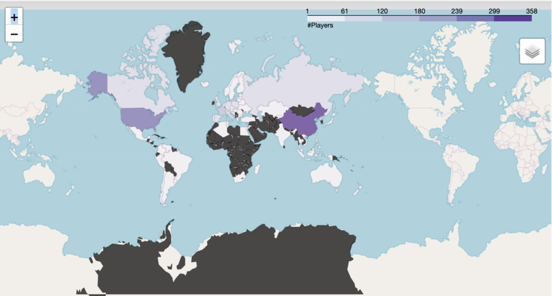

# hearthstoneAnalyzer
## intro 
Use python to implement the hearthstrone analyzer. Jupytor is recommended to run the code for data visualization. Please run the code with python3 for full performance

## Output
Hearthstone player distribution

Other outputs are in graph folder.
